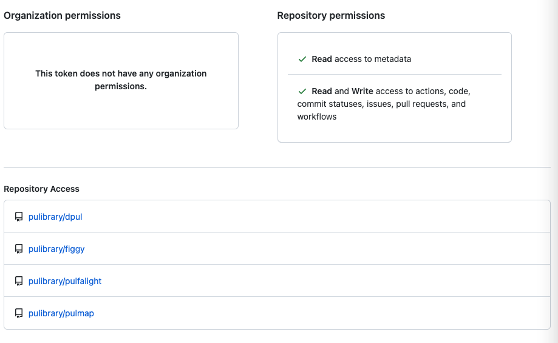

# Automated Bundle Update Documentation

Pulmap generates a PR with the output of `bundle update`. This is done via
Github actions, as defined in
[.github/workflows/bundle_update.yml](../../.github/workflows/bundle_update.yml).

## Creating an Access Token

This workflow requires an access token in Github. You can create and manage it
here: [fine grained access
tokens](https://github.com/organizations/pulibrary/settings/personal-access-tokens/active).

The specific token is here:
[dls-update-dependencies](https://github.com/organizations/pulibrary/settings/personal-access-tokens/1340).

The following is a screenshot of the settings that need to be set:

